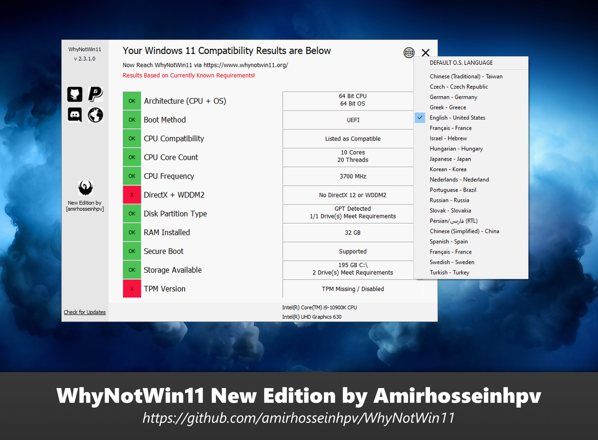
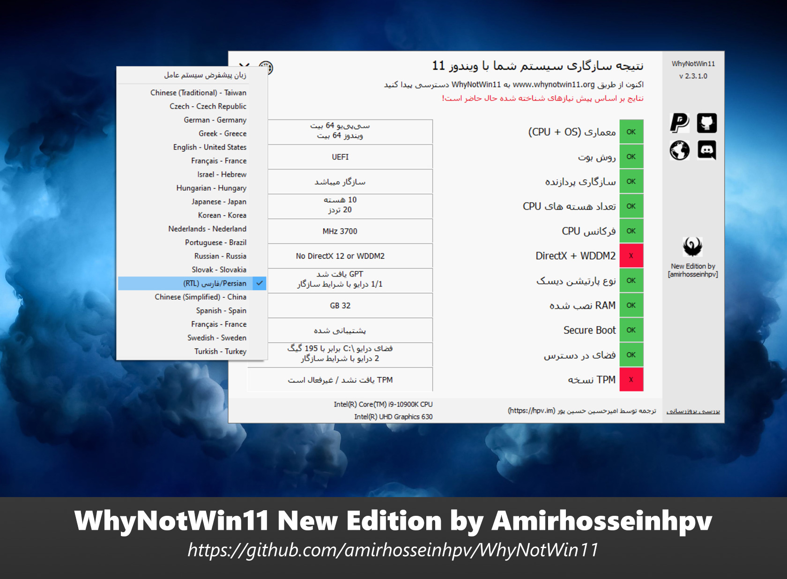

# WhyNotWin11
Detection Script to help identify why your PC isn't Windows 11 Release Ready

----

## New Edition, Version 2.3.1

In this version I've enhanced multi-lingual feature so users can select language from a list and apply custom language regarding their own system locale.

I've also changed UI a bit, made the whole window dragable and changed Font size.

* DEV: Added _GUICtrlSetDataEx function to set Control item's data and color at-once, and also generates auto-color based on ctrl text

* DEV: Added Restart Feature, could be called with _ScriptRestart

* DEV: RTL/LTR Fully supported, just add RTL=true in MetaData section of your language

* DEV: Exit button text changed from X to × which look cool :)

* DEV: Added my logo to resources

## Download

[Download latest stable release](https://github.com/rcmaehl/WhyNotWin11/releases/latest/download/WhyNotWin11.exe)

[Download latest testing release](https://nightly.link/rcmaehl/WhyNotWin11/workflows/wnw11/main/WNW11.zip)\
**Keep in mind that you will have to update testing releases manually**

## To-Do

- [x] Hard Floor Checks:
    - [x] Cores >= 2
    - [x] CPU Freq >= 1 GHZ
    - [X] CPU Arch = 64
    - [x] RAM >= 4 GB
    - [x] Storage >= 64 GB
    - [x] ~~TPM >= 1.2~~ (Removed with recent changes from Microsoft)
    - [x] SecureBoot
    - [x] ~~SMode~~ (WhyNotWin11 is not compatible with S Mode Devices)
- [x] Soft Floor Checks:
    - [x] TPM >= 2.0
    - [x] CPU Compatibility list
- [ ] Other Checks:
    - [x] DirectX 12
    - [x] WDDM 2
    - [ ] Screen Resolution
- [x] A fancier GUI

## Compiling

1. Download and run "AutoIt Full Installation" from [official website](https://www.autoitscript.com/site/autoit/downloads). 
1. Get the source code either by [downloading zip](https://github.com/rcmaehl/WhyNotWin11/archive/main.zip) or do `git clone https://github.com/rcmaehl/WhyNotWin11`.
1. Right click on `WhyNotWin11.au3` in the WhyNotWin11 directory and select "Compile Script (x64) (or x86 if you have 32 bit Windows install).
1. This will create WhyNotWin11.exe in the same directory.

## License

WhyNotWin11 is free and open source software, it is using the LGPL-3.0 license.

See LICENSE for the full license text.
